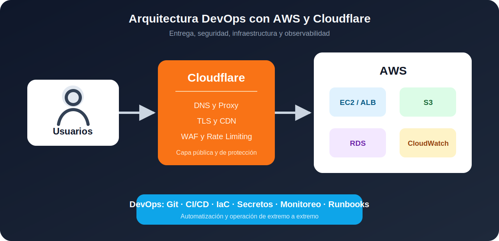

# Ruta DevOps: AWS y Cloudflare

Esta documentación presenta una ruta práctica para que un profesional **DevOps** comience a trabajar con servicios cloud orientados a aplicaciones web. El objetivo no es memorizar productos, sino aprender a diseñar una arquitectura, automatizar despliegues, proteger el origen y observar el comportamiento del sistema.



!!! note "Objetivo principal"
    Al terminar la guía podrás desplegar una aplicación en AWS, publicar un dominio con Cloudflare, habilitar HTTPS, aplicar reglas básicas de seguridad y establecer una base de monitoreo y operación.

## Responsabilidad de cada plataforma

| Plataforma | Responsabilidad principal | Servicios iniciales |
| --- | --- | --- |
| AWS | Ejecutar aplicaciones, almacenar datos y proporcionar infraestructura escalable. | IAM, VPC, EC2, S3, RDS, CloudWatch y AWS Budgets |
| Cloudflare | Administrar DNS, proteger el tráfico público y acelerar la entrega de contenido. | DNS, Proxy, SSL/TLS, CDN, WAF y Rate Limiting |
| DevOps | Automatizar, documentar, monitorear y mantener el servicio disponible. | Git, CI/CD, IaC, logs, métricas, alertas y runbooks |

## Modelo mental de la arquitectura

```text
Usuario
  │
  ▼
Cloudflare
DNS + TLS + WAF + CDN
  │
  ▼
AWS
Balanceador o servidor web
  │
  ├── Aplicación
  ├── Almacenamiento
  └── Base de datos
```

Cloudflare funciona como la capa pública de entrada. AWS funciona como el origen donde se ejecuta la aplicación y se almacenan sus datos. El trabajo DevOps conecta ambas capas mediante automatización, seguridad y observabilidad.

## Competencias que debes desarrollar

=== "Infraestructura"

    ```text
    IAM y control de acceso
    Redes VPC y grupos de seguridad
    Cómputo con EC2 o contenedores
    Almacenamiento con S3
    Bases de datos administradas
    ```

=== "Entrega"

    ```text
    Repositorio Git
    Pipeline de integración continua
    Despliegue automatizado
    Variables y secretos seguros
    Estrategia de rollback
    ```

=== "Operación"

    ```text
    Logs y métricas
    Alertas accionables
    Copias de seguridad
    Gestión de incidentes
    Control de costos
    ```

## Ruta sugerida

1. Aprende los [fundamentos cloud](fundamentos-cloud.md).
2. Completa un [primer despliegue](primer-despliegue.md) con AWS y Cloudflare.
3. Aplica las prácticas de [operación y seguridad](operacion-seguridad.md).
4. Revisa el [entorno MkDocs](entorno-mkdocs.md) para ejecutar esta documentación sin confundir advertencias con errores.

!!! warning "No empieces por producción"
    Crea primero un entorno de laboratorio. Utiliza recursos pequeños, activa presupuestos y elimina los servicios que ya no necesites para evitar cargos inesperados.
